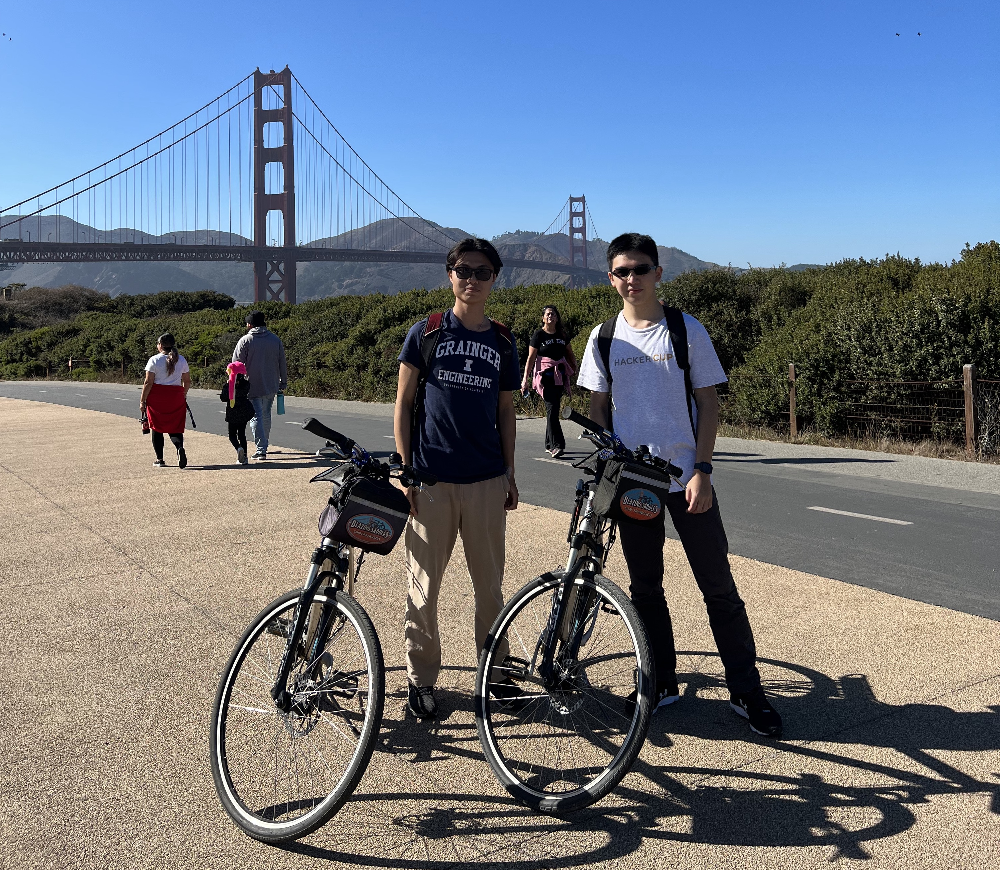
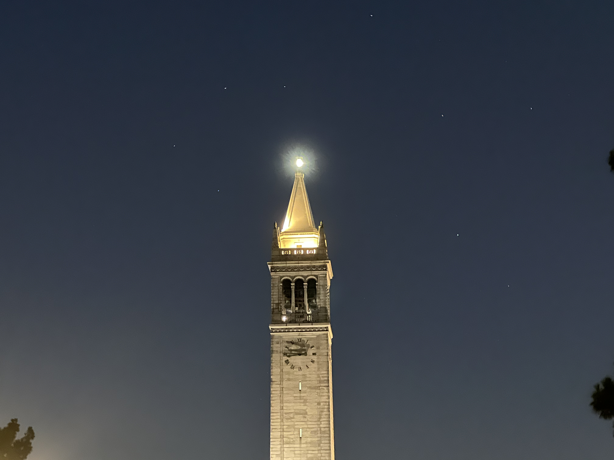
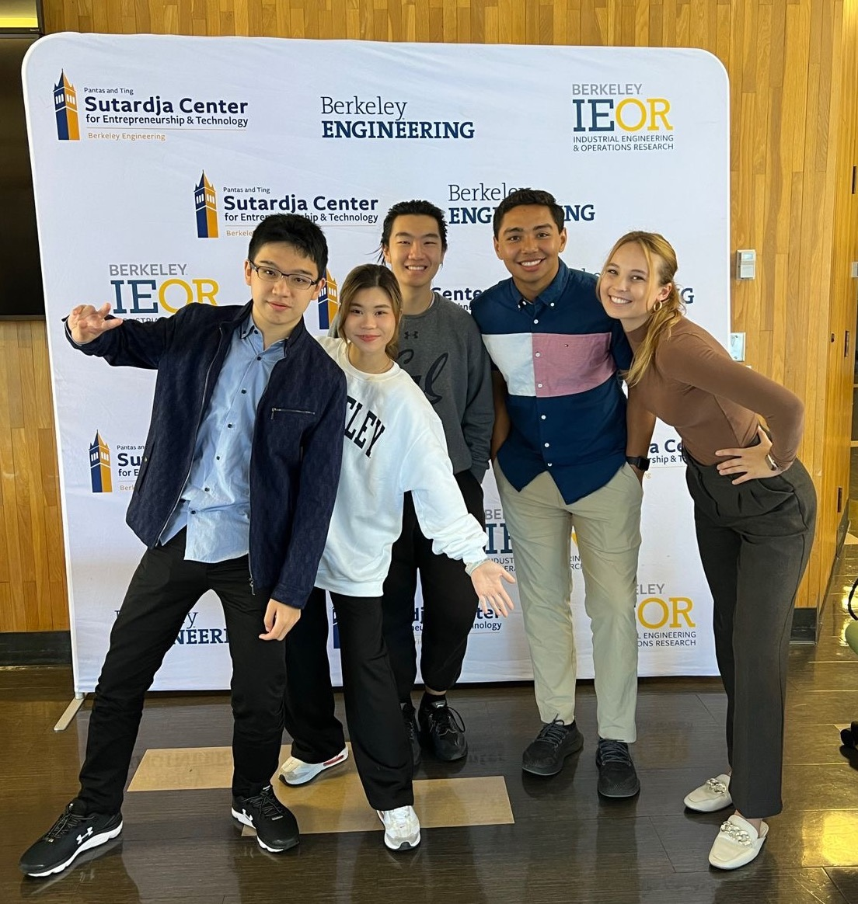
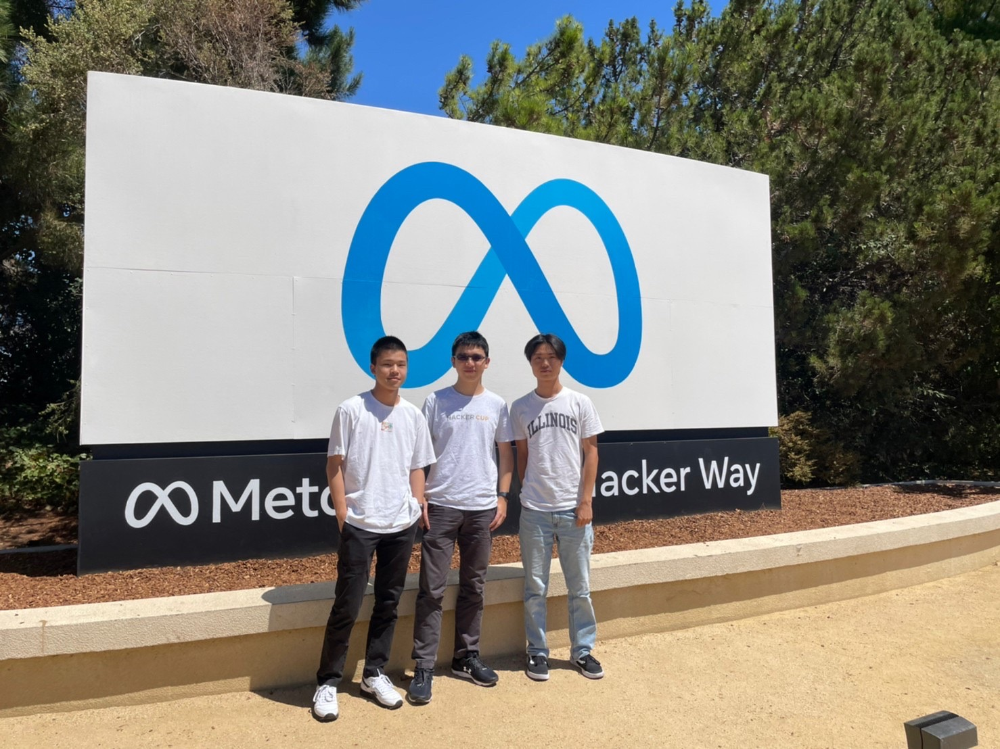
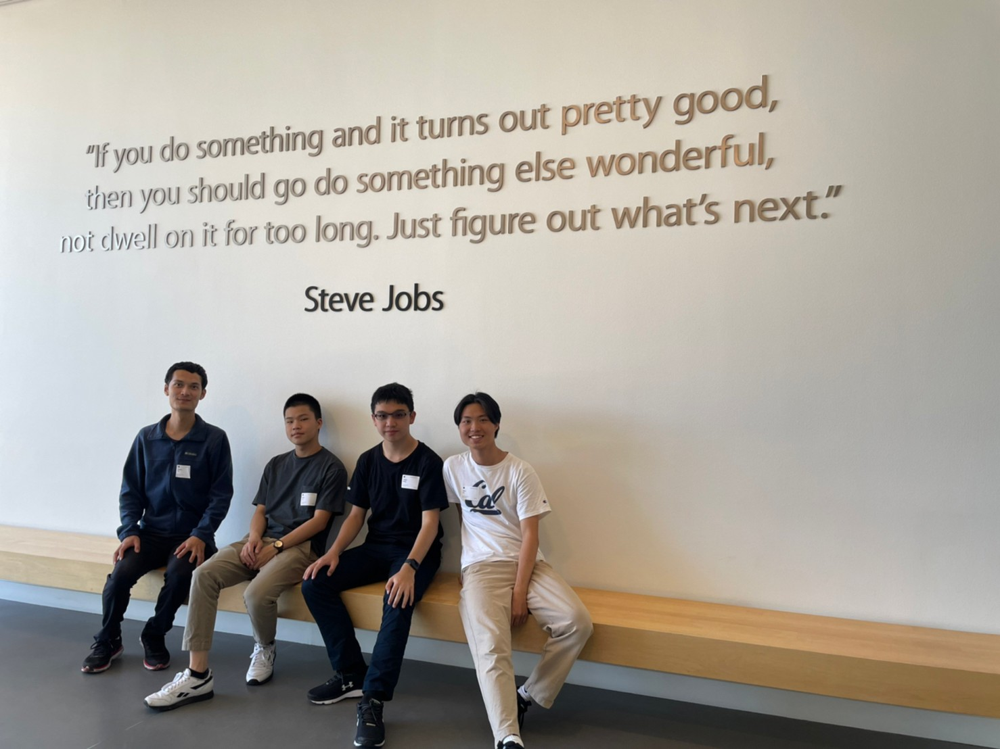

---

### 前言

高二第三度參加 Young Turing Program 的專題終於進入第三階段，最後也有幸和劉至軒一起獲得了出國參訪的機會，由於疫情緣故拖到了升大二的暑假才得以成行，以下是關於這段旅程偏流水帳式的紀錄。

---

### Day 1

劉至軒表示他的暑假結束了，剛好我的暑假開始了(x

快兩年沒坐飛機了有點緊張，還好除了坐在最後一排有點吵以外沒什麼大問題，甚至是本來想在飛機上做點事結果不小心就連睡了 8 個小時，時差直接調好xD 到達舊金山後因為在機場排隊排太久來不及吃晚餐，所以在美國的第一餐最後是在 Airbnb 用泡麵解決><

---

### Day 2

早上睡到飽後我們從 Downtown Berkeley 搭當地的捷運（BART）到舊金山 Powell Street，午餐順勢在旁邊的商場美食街解決，一份正常的漢堡加薯條套餐居然要 $20，自己刷卡才正式體驗到美國物價QAQ

因為有朋友剛好有問我能不能幫忙買鞋子因此就找到藉口開始在商場逛街，不過他要的東西找不到，我跟劉至軒倒是各買了一雙 VANS。

下午到舊金山現代藝術博物館（SFMOMA）逛逛，原本都以為我們對美術館不會太有興趣，不過意外的看到一些蠻有特色的展覽品（像是跟 101 一模一樣的裝置藝術品），也算是陶冶一下文藝氣息，裝文青成功！

傍晚精誠幫我們安排跟 GEMINI 在當地的一位薩爾瓦多資深工程師吃飯聊天，吃的是一間偏高檔的秘魯餐廳，大概是第一次在日式料理以外的地方吃到生魚片，超讚ㄉ

---

### Day 3

因為前一天睡得太晚所以一起床就是午餐時間，我們在 Berkerley 校園附近晃了許久，最後選擇走進一家波斯餐廳用餐，我點的是 Ghormeh Sabzi，一種燉肉的 style，雖然沒有非常對胃口不過也算是個不錯的體驗啦。

之後我們在 Starbucks, Berkeley 校園紀念品店買了一點東西（可能不只一點）後就回到 Airbnb 休息一下。

到了傍晚為了準備今天的晚餐決定前往附近的超市採購食材，晚上當然就是自己煮啦>< 主菜是紐約客牛排，搭配甜椒、蘑菇、馬鈴薯泥等等佐料，利用 Airbnb 現有的各式鍋碗瓢盆胡搞瞎搞，意外的十分成功xD

---

### Day 4

今天我們的目標是要逛 SF 北岸，不過因為睡得有點太晚，當我們終於搭 BART 轉公車到達 Fisherman Wharf pier 39 的時候已經下午兩點了，午餐選擇在一家海港邊的餐廳解決，Clam Chowder 配上各種海鮮類炸物，算是漁人碼頭這邊道地的選擇吧xd 接著我們繼續在海港邊亂逛，看到了一大群趴在碼頭附近的海獅，有的甚至還會打架，超級可愛(x

根據前天那位當地工程師的建議，我們於是去借了自行車，決定挑戰從 Fisherman Wharf 這邊一路向西，穿越 Golden Gate Bridge！雖然不過是 13 公里的距離，但因為上下坡幅度實在很大而且那裡也沒有自行車道，我們騎了超久才抵達目的地：）記得上次來舊金山的時候也有到金門大橋參觀，不過今日第一次穿越，真正體會到了什麼叫做橋上風很大的感覺，龍頭甚至必須要彎向另一邊才不會被吹倒(x

回程的時候因為太累加上時間有點晚就決定從對岸搭船回來了，最後甚至還差點趕不上 BART 末班車QAQ

---

### Day 5

為了不讓隔天的營隊大遲到，我們今天開始練習早起，一早就跑到 Telegraph street 上的一間咖啡廳吃早餐做事情，終於把從飛機上就一直說要做但卻一路放到現在的履歷寫完了><

中午我們在街上隨意找了間墨西哥餐廳，Burrito 很好吃但份量實在太多了，完全吃不完QQ

下午沒有什麼事情，在校園內晃一晃後我們就折返回 Airbnb 煮晚餐了，今天的成品是奶油燉飯！

---

### Day 6

玩了五天後終於進入此行的主要目的 - Berkeley BMOE Camp！集合時間是早上 8 點半，我們抵達會場後就遇到了營隊的負責人，來自臺灣而目前在 UC Berkeley 任教的 Gigi Wang 教授，和她簡單的寒暄後就進入了會場。

這個營隊的參與者其實絕大多數是 UC Berkeley 當地的學生，像我們這樣的國際學生大約只佔了 20% 左右，不過分佈十分多元，從臺灣、奧地利、泰國、西班牙、英國等等都有，而且在之後的聊天後發現，他們大都也是有得到國內企業、學校贊助而來的(x

在簡單的開場與說明營隊規則後就直接進入 pitch 的時間，主持人讓所有有想到 startup idea 的人報名並按照隨機順序請大家輪流上臺在一分鐘內 pitch 自己的想法。可怕的不是要上臺，可怕的是我居然被抽到第一個QAQ 還好在 YTP 的提醒下我們前一天就有簡單順過一次該如何上臺 pitch，最後也成功地在恰一分鐘內講完我的 idea。

下午是分組時間，有 startup idea 的人可以選擇要自己找組員或是加入自己有興趣的組別，剛結束 APCSC 的我覺得當 leader 實在好累，就跑去加別人組了，我們這組的組成是三個 Berkeley 學生、一個泰國學生和我，想做的則是一個校園內的交友平臺。

接下來的活動應該算是破冰小遊戲(?) 每組給我們一個裝著乾義大利麵麵條的牛皮紙袋和一個棉花糖，我們的任務是在 18 分鐘內用這些義大利麵條建出一座越高越好的塔，並且要穩定到足以將棉花糖放置於最上方而不倒。我們這組一開始的策略不錯，原本有機會拿到前幾高的名次，不過因為蓋好後還剩下兩分鐘，於是就貪心的想讓塔變得再高一點，不過最後卻因為不平衡而整個崩塌了xD

晚餐在同組的隊員提議下到附近的 Eureka! 漢堡店聚餐順便繼續討論，對於他們習慣吃完飯後直接將總價前除以人數來算每個人該付多少感到吃驚，也算是體驗到了臺灣跟美國不同的消費文化。

---

### Day 7

今天早上的 lecture 他們請了幾個在矽谷有 Startup 經驗的人來跟我們分享故事，其中有一個是做線上紀念冊設計的，要是早生十年的話感覺會是我有興趣的主題(x

午餐時間公佈了今天下午的活動 -- 物品交換大賽？其實就是讓我們玩前陣子不少 youtuber 都在臺灣實驗過的遊戲，一開始給我們每組一支學校紀念原子筆，然後要我們在兩個小時內的時間內在學校附近到處找人換東西，比賽誰換到的東西最有價值。我們一開始碰到的問題是大部分的路人都只會願意拿原子筆跟我們換原子筆，於是後來我們只好採用別的策略，直接跟對方說明這是一場遊戲然後我們想要贏XD 最後換到了一個 Berkeley 名片吊帶和一個法律學院的行動電源。原本以為我們已經表現很好了，結果發現有人換到了數千美金的藝術馬克杯還有人甚至換到了 intern 機會！？

今天還有另一件出乎意料的事情發生在和同組一位 Berkeley 中國學生 Ryan 聊天時，因為他下個學期就要準備畢業了原本想稱他學長，結果發現他比我還小一歲...

---

### Day 8

因為前一天太累導致我跟劉至軒兩個人一起錯過了連響半個小時的鬧鐘，等我自然醒時已經 10 點了，直接遲到一個半小時QQ 所幸順便晃去買了杯咖啡再進去上課：）

早上一樣是聽 lecture 就不特別紀錄了，下午有一個比較有趣的內容是 Elevator pitch，他們做了一個類似電梯的佈景，然後讓每組派人實際假設在電梯裡遇到投資人的場面並嘗試向他們 pitch，不過我沒有負責去講，下午就在和組員的討論中度過。

今天的晚餐 Ryan 帶我和被隊友拋下的劉至軒去吃一間有賣各種亞洲食物的店，韓式牛小排的 cp 值意外的高。

回去後剛好有一個 mentor 過來關心我們組，於是就不小心跟他聊了好久，有更加了解這裡的 Startup 生態一點了。不過後果是我們的報告要做不完了，因此在其中一個隊員 Ineka 的提議下便到她家繼續討論，最後弄到 12. 多才回去。

---

### Day 9

今天沒有太多特別的行程，就是準備報告而已，值得一提的是我在這次的報告中因為要做公司成長的財務報表(?)所以意外的被主修 business 的隊友 Rafael 教了許多財務相關知識，希望他不會覺得臺灣人都很笨(x

還有另一個觀察到有趣的點是 Berkeley 的學生似乎沒有在重要報告前事前擬稿或是計時的習慣，雖然他們 presentation 的能力不錯但總覺得如果多練習幾次可以做得更好(?)

---

### Day 10

今天是報告日，我們這組被抽到那個 track 的第一組報告，沒有出太大的問題就順利完成了 pitch，不過可惜的是 investor 似乎對於我們的想法不太認同。

最後我們這個 track 得獎的組別是我們第一天認識的奧地利人領導的 Onboarding Hero，是一個想優化實習、工作 onboard 流程的 idea，據說他們真的打算創業！

營隊在這邊就大致上告一段落了，最後是讓大家聊天、交換 Linkedin 的餐敘，也就是所謂的 Social Networking，最有印象的是跟一個畢業後打算創業的 senior 聊天，他說他的女朋友是臺灣人xD

因為有點累了我們就沒有參加之後的 after party，決定去找接下來準備翹課跟我們一起玩的劉冠宏會合，一起吃完晚餐後到他租的房子混一下，居然就住在學校旁邊，比我家離臺大還近(x

---

### Day 11

今天的目標是要南下 San Jose，也就是要正式踏入矽谷了！一大早我們就和精誠的 Alice 會面並在 Downtown Berkeley 吃早午餐，接著就出發南下。

首先到達的第一站是座落於 Hacker way 上 ~~Facebook~~ Meta HQ，他的辦公室建築意外的醜xD 而且好像因為疫情緣故無法入內參觀，和巨大的 Logo 拍張照後就離開了。接著我們也開到附近的 HP 紀念碑、Meta 實驗室，搶先體驗在 Metaverse 裡玩音遊(x

在吃晚餐前不知道去哪裡的我們發現附近有一個 Winchester Mystery House 就決定進去參觀了，這是一棟由一個軍火商的遺孀打造的詭異建築，裡頭有打開來是牆壁的門還有走下去會再走上來所以哪裡也去不了的樓梯，唯一的缺點是票價有點貴。

晚上 Alice 幫我們安排和她的朋友一起用餐聊天，被招待了一間高檔的法式餐廳，劉至軒還認到了 UIUC 的學長xD

---

### Day 12

今天的目標是 CA 的另一所超有名大學 -- Stanford University，因為劉至軒和劉冠宏都來過了因此今天就是他們帶著我逛逛，這所學校和 Berkeley 走的是不一樣的風格，相對於 Berkeley 的希臘羅馬風，這邊的建築大部分是紅磚，且因為校園面積比 Berkeley 更大，有很多半圓拱門和走廊的設計，給人一種悠閒自在的感覺。

離開 Stanford 後我們到 Computer History Museum 參觀，整個博物館動線其實就是電腦科學的演進史，從最早的計算機到 Alan Turing 與他的解密機器，再來到第一代的麥金塔和 Windows 98，完全可以理解為什麼那個時代機械系會長期霸佔第一志願了。

晚餐是飯店附近的一間 fish & chips，感謝日檢大師劉至軒><

---

### Day 13

今天是此行最期待的行程之一！早上吃完早餐後我們就出發前往 Google 園區，Alice 幫我們聯絡了蘇多門學長帶我們參觀，在園區內一邊聊天一邊走走晃晃，和不知道為什麼存在的恐龍拍了張照，然後發現這裡居然有 laundry 就知道 Googler 平常有多血汗了(x 

接近中午的時候轉移陣地到 Apple 總部，也就是傳說中半個城市都被蘋果買下的 Cupertino，道路的名稱看起來很多都是他們取的，Infinite Loop 超酷xD 中午在 Alice 朋友的帶領下我們就在這邊的員工餐廳用餐聊天，聽著蘋果工程師娓娓道來灣區的生態與近況。

傍晚 Alice 幫我們安排跟一位在 Berkeley 這邊的 Seed Accelerator 協助新創公司發展的臺灣人喝下午茶，聽他聊一聊矽谷的創業生態以及他給臺灣學生的生涯規劃建議，回去打算 follow 他的 podcast！

---

### Day 14

Alice 他們今天要出發去 LA 了，早上吃完早餐後便和他們告別。回到飯店休息一下後，我們選擇先寄放行李在飯店然後到旁邊的 Innovation Museum 逛一逛，其實它基本上就是科教館，三個大學生花了 40 分鐘在玩設計路線讓球滾的遊戲(x

下午我們搭 Uber 一路北上抵達接下來三天要住的 Airbnb，不愧是一個晚上要價 $400 多的地方，除了客廳、餐廳、廚房外，我們一個人有一間房間還有各自的廁所xD

既然都有廚房那晚餐當然是要自己煮了，這次在大廚劉冠宏的指導下完成了肋眼牛排和巧達濃湯！

---

### Day 15

早上因為 Airbnb 實在太舒服導致大家都不太想出門，接近中午時才搭車到 Fisherman Wharf 吃 In-N-Out Burger，主要是因為上次來美國的時候對它的印象非常好，就想再吃一次，果然不負期待，而且一份漢堡套餐只要 $10 在 Bay Area 根本超划算xD

我們接著搭 Ferry 前往 Alcatraz（惡魔島），一個以關押重刑犯出名的地方，因為監獄很早就已經廢棄了，島上本該是斷垣殘壁的破敗景象，不過現在卻又因為充滿觀光客所以顯得十分熱鬧。爬到最上面是一座保存的最完整的監獄，裡面有免費的語音導覽，介紹在這座島上發生的故事還有囚犯們在這裡的生活環境等等，確診才被隔離一週就快要受不了的我，實在很難想像被關在這裡 40 年的感受。走出展覽館後也可以自由在附近閒逛拍照，從這邊眺望舊金山，整座城市可以盡收眼底！

---

### Day 16

今天劉冠宏要回學校上課了，我和劉至軒則是睡到自然醒後決定到 Golden Gate Garden ~~老人行程~~散步走走，晃到累了後就到附近的 Starbucks 做事，然後發現 Starbucks 的咖啡在灣區真的很便宜（實際價格跟臺灣一樣）。

今天的晚餐十分精彩，我們弄了一整隻烤雞、肉醬義大利麵和烤甘藍，回臺灣要認真減肥了xD 晚餐後還體驗了在臺灣不合法的東西，大家都說第一次不會有什麼感覺，不過看來我 cp 值特別高xD 只能說真的不喜歡，頭暈晃來晃去然後還會很想睡覺QQ

---

### Day 17

因為 Airbnb 沒辦法讓我們寄放行李於是決定把行李寄放在劉冠宏家，在他家耍廢到傍晚才出發去機場。

因為劉至軒要搭的是國內線，因此抵達 SFO 後就是自己一個人了，第一次自己搭飛機，除了在等待的時候因為沒有人可以聊天所以略顯無聊以外沒什麼感覺，上飛機後一路睡覺就回到臺灣，結束這趟疫情下難得的旅行。

---

### 後記

* 灣區物價真的好貴，難怪 FED 要抑制通膨
* 來 Berkeley 讀 master 感覺是個不錯的選擇，看來接下來要更努力了
* 有了不少新的體悟，也發現有更多東西想學，繼續加油><
* 感謝精誠企業的 Young Turing Program，也希望以後要是有機會在國外工作或求學時能回饋給學弟妹！